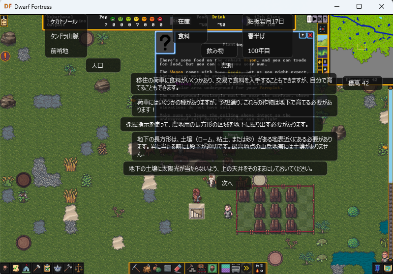

# dwarf-fortress-jp-helper

Windows 版 Dwarf Fortress 向けの日本語プレイ補助ツールです。
`dfhooks.dll` でゲーム内テキストをフックし、タスクトレイ常駐型のオーバーレイで翻訳結果を表示します。
本体そのものを日本語化するものではなく、英語テキストの理解を補助することを目的にしています。

## Screenshot

ゲーム画面と翻訳オーバーレイの例です。



## 主な機能

- Dwarf Fortress の表示テキストをフック
- Google Translate / DeepL を使った翻訳
- カーソル位置のテキストだけ表示する hover モード
- 画面内テキスト全体に重ねて表示する all text モード
- タスクトレイ常駐。トレイアイコンで表示 ON/OFF、ホットキーで `Hover -> All text -> Off` を循環切替
- RVA 自動検出
- Python 未導入環境でも使える `DFJP.exe`
- TSV 形式の手動翻訳ルール
- 検出した英語テキストを手動翻訳ルールに自動収集するモード

## 構成

- `hook/`
  - `dfhooks.dll` をビルドする C++ コード
- `translator/`
  - PySide6 ベースの翻訳表示アプリ
- `tools/detect_offsets.py`
  - Dwarf Fortress 更新時の RVA 自動検出
- `scripts/build_release.ps1`
  - 配布用 ZIP 作成

## 対応環境

- Windows
- Dwarf Fortress Steam 版

## 使い方

配布 ZIP を使う場合:

1. ZIP の中身を `Dwarf Fortress.exe` があるフォルダへ展開します。
2. `DFJP.exe` または `DFJP起動.cmd` を実行します。
3. 初回起動時は RVA を自動検出して `dfint-data/offsets-dfjp-auto.toml` を作成します。
4. 翻訳オーバーレイの準備ができたら、そのまま Dwarf Fortress を起動します。
5. 起動後は、タスクトレイアイコンのクリックで表示 ON/OFF、設定したホットキーで `Hover -> All text -> Off` を循環切替できます。

## 設定ファイル

配布版では初回起動時に `dfjp-data/config.toml` が自動生成されます。
ソースから実行する場合は `translator/config.toml` を編集してください。

主な設定項目:

- `translator.engine`
  - 使用する翻訳エンジン
  - `"google"` または `"deepl"`
  - デフォルトは `"google"`
- `translator.target_language`
  - 翻訳先言語コード
  - 例: `ja`, `en`, `ko`, `zh-CN`
  - デフォルトは `ja`
- `deepl.api_key`
  - DeepL を使う場合の API キー
- `overlay.tooltip_opacity`
  - 翻訳ツールチップの透過率
  - デフォルトは `0.78`
- `overlay.all_text_vertical_shift_ratio`
  - all text モードで重なったツールチップを縦にどれくらいずらすか
  - `0.5` = 半分ずらす / `1.0` = 完全にずらす
  - デフォルトは `1.0`
- `overlay.translation_font_size`
  - 翻訳テキストのフォントサイズ
  - デフォルトは `12.0`
- `overlay.toggle_hotkey`
  - オーバーレイ表示切替キー
  - 押すたびに `Hover -> All text -> Off` を切替
  - `"ctrl"` / `"shift"` / `"alt"`
  - デフォルトは `"ctrl"`
- `manual_rules.collect_detected_text`
  - `true` にすると、ゲーム中に検出したテキストを実行中の `manual_translation_rules.tsv` に `exact<TAB>原文<TAB>` の形で追記
  - 手動翻訳候補の収集用。デフォルトは `false`
- `debug.log`
  - `true` のとき、詳細ログを `debug.log` に出力
  - 配布時のデフォルト設定は `true`

設定例:

Google Translate で日本語表示:

```toml
[translator]
engine = "google"
target_language = "ja"

[deepl]
api_key = ""

[overlay]
tooltip_opacity = 0.78
all_text_vertical_shift_ratio = 1.0
translation_font_size = 12.0
toggle_hotkey = "ctrl"

[manual_rules]
collect_detected_text = false

[debug]
log = true
```

Google Translate で英語表示:

```toml
[translator]
engine = "google"
target_language = "en"
```

DeepL で日本語表示:

```toml
[translator]
engine = "deepl"
target_language = "ja"

[deepl]
api_key = "YOUR_DEEPL_API_KEY"
```

all text モードで少し透けさせる例:

```toml
[overlay]
tooltip_opacity = 0.55
all_text_vertical_shift_ratio = 1.0
translation_font_size = 12.0
toggle_hotkey = "ctrl"
```

Shift キーでモード切替:

```toml
[overlay]
toggle_hotkey = "shift"
```

日本語を少し小さめに表示:

```toml
[overlay]
translation_font_size = 11.0
```

検出テキストを手動翻訳ルールへ収集:

```toml
[manual_rules]
collect_detected_text = true
```

## 手動翻訳ルール

手動翻訳ルール関連ファイル:

- 配布 ZIP: `dfjp-data/manual_translation_rules.tsv`
  - チュートリアルまでの手動翻訳入りファイルを同梱
- GitHub ソース: `translator/manual_translation_rules.template.tsv`
  - 骨組みだけを保持するテンプレート
- ソース実行時に生成: `translator/manual_translation_rules.tsv`
  - 初回起動時にテンプレートから自動生成

1 行 1 ルールの TSV 形式です。

- `exact<TAB>source<TAB>target`
- `regex<TAB>pattern<TAB>replacement`

`exact` は完全一致です。
`regex` は原文全体に対する正規表現マッチで、置換文字列では `\1` のようなキャプチャ参照が使えます。

訳文が空の `exact` ルールは「未翻訳の手動候補」として扱われ、機械翻訳の結果を上書きしません。
自動収集モードではこの空訳文形式で追記されます。

例:

```tsv
exact	Start new game in existing world	既存の世界で新しいゲームを始める
regex	^(\d+)(?:st|nd|rd|th) Slate$	\1番目のスレート
exact	Mining (2 of 8)	
```

フィールド内で改行やタブを 1 行で表したい場合は、次のエスケープを使えます。

- `\n` = 改行
- `\t` = タブ
- `\r` = 復帰
- `\\` = バックスラッシュ

## キャッシュとログ

翻訳キャッシュ:

- 配布版: `dfjp-data/translation_cache.json`
- ソース実行時: `translator/translation_cache.json`

ログ:

- 配布版: `dfjp-data/debug.log`
- ソース実行時: `translator/debug.log`

翻訳エンジンや翻訳先言語を切り替えたあとに古い訳文が残る場合は、`translation_cache.json` を削除してください。

## ソースからの開発

Python 実行:

```powershell
cd translator
uv sync
uv run python main.py
```

RVA 自動検出:

```powershell
python tools\detect_offsets.py "C:\path\to\Dwarf Fortress.exe" --output dfint-data\offsets.toml
```

## リリースビルド

```powershell
powershell -ExecutionPolicy Bypass -File scripts\build_release.ps1
```

出力:

- `dist/DFJP.zip`

配布 ZIP には次のライセンス関連ファイルも含まれます。

- `LICENSE`
  - DFJP 自体の MIT License
- `THIRD_PARTY_LICENSES/`
  - 同梱ランタイム・Python パッケージ・補足ライセンス文書
  - `THIRD_PARTY_LICENSES.md` に一覧を出力

ライセンス面の整理のため、配布版の GUI ランタイムは PyQt6 ではなく PySide6 を使用しています。

## License

MIT License

## 注意

- `dfhooks.dll` を使用するため、DLL を利用する他ツールとは競合する可能性があります。
- 本プロジェクトは翻訳補助ツールであり、ゲーム本体の表示言語を日本語化するものではありません。
