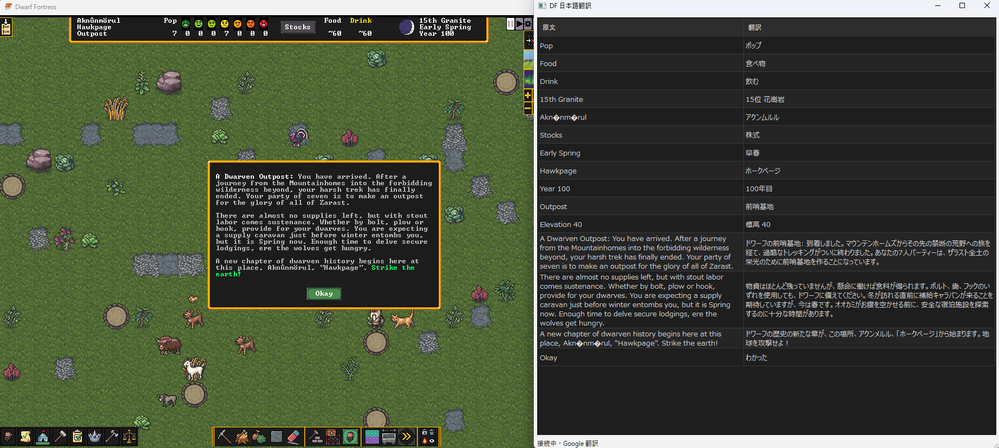

# dwarf-fortress-jp-helper

Windows 用の Dwarf Fortress 日本語プレイ補助ツールです。

このプロジェクトは Dwarf Fortress 本体のテキスト描画関数をフックし、ゲーム内で表示された英語テキストを別ウインドウに集約して、日本語訳を表示します。Dwarf Fortress 本体の日本語化そのものではなく、外部の翻訳支援ウインドウを表示する補助ツールです。

## Screenshot

ゲーム画面と翻訳ウインドウを並べた動作例です。



## 主な構成

- `hook/`
  - `dfhooks.dll` をビルドする C++ コード
  - Dwarf Fortress の描画関数をフックし、取得した文字列を Named Pipe で送信
- `translator/`
  - PyQt6 ベースの翻訳ウインドウ
  - Google 翻訳 / DeepL を利用可能
- `tools/detect_offsets.py`
  - Dwarf Fortress のバージョン更新で変化する RVA を実行ファイルから自動検出
- `scripts/build_release.ps1`
  - `dfhooks.dll` と `DFJP.exe` をまとめた配布 ZIP を生成

## できること

- Dwarf Fortress の表示テキストを外部ウインドウへ転送
- フレーム中に分散して届く単語列を文単位へ近似的に再構成
- 日本語訳をリアルタイム表示
- Dwarf Fortress 更新後の RVA を自動検出
- Python がない環境向けに `DFJP.exe` を作成

## 対応環境

- Windows
- Dwarf Fortress Steam 版系統

## 使い方

配布 ZIP を使う場合:

1. ZIP の中身を `Dwarf Fortress.exe` があるフォルダへ展開
2. `DFJP.exe` または `DFJP起動.cmd` を実行
3. 初回起動時に `dfint-data/offsets-dfjp-auto.toml` を自動生成
4. 翻訳ウインドウが表示されたら Dwarf Fortress を起動

## ソースからの開発

Python 側:

```powershell
cd translator
uv sync
uv run python main.py
```

RVA 自動検出:

```powershell
python tools\detect_offsets.py "C:\path\to\Dwarf Fortress.exe" --output dfint-data\offsets.toml
```

## リリースビルド

```powershell
powershell -ExecutionPolicy Bypass -File scripts\build_release.ps1
```

生成物:

- `dist/DFJP.zip`

## License

MIT License

## 注意

- `dfhooks.dll` を使うため、同名 DLL を利用する他ツールとは競合する場合があります。
- 本プロジェクトは外部翻訳補助ツールであり、ゲーム本体の描画を直接日本語化するものではありません。
